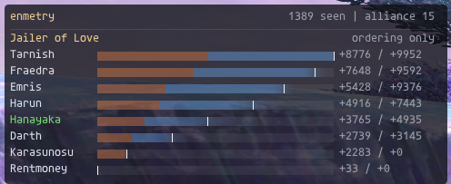

# enmetry

A passive enmity tracker for HorizonXI. It rebuilds the server's enmity
container from packets it only watches, then shows every player's CE and VE
with an honest uncertainty band over the Enmity+ gear and merits nobody can
see. It reads: it sends no packets, acts for no one, and automates nothing.



## Reading the panel

| What you see | What it means |
| --- | --- |
| `Jailer of Love` | the mob in focus; one mob is shown at a time, though every engaged mob is tracked |
| `ordering only` | this list was joined already in progress, so the totals are relative to whoever was on it first, not absolute. A `+` on every row says the same |
| green name | you |
| orange segment | CE, which never decays |
| blue segment | VE, decaying 60 a second |
| pale tick | the posterior median |
| how far a bar fades | the uncertainty band: solid across the range the addon is sure of, fading outward |

Rows are sorted by CE + VE.

## What it does

- A particle filter infers each player's unreadable Enmity+ gear and Muted
  Soul merits from which players mobs attack, so each bar is a distribution
  rather than a point estimate.
- Buffs and your own gear are applied exactly, against a port of
  LandSandBoat's `CEnmityContainer` that keeps its float32 arithmetic and
  truncation.
- A calibration readout reports how often the 80% band contained the truth.
- Per-server, per-character memory of what was learned about a player, decayed
  back toward the job prior with time since last seen.
- Every packet, decision and frame cost goes to a session log that
  `tools/replay.lua` can run again. Open questions about Horizon's enmity are
  tracked in a research registry that scores them against logged fights.

The design is in [DESIGN.md](DESIGN.md) and the build plan in
[tickets.md](tickets.md).

## Install

Download the zip from [Releases](../../releases) and unpack it into your
Ashita install's `addons/` folder; it holds a single `enmetry/` directory, so
it lands in the right place on its own.

From a checkout instead:

```sh
python tools/deploy.py --ashita "D:/Ashita/game"
ENMETRY_ASHITA="D:/Ashita/game" python tools/deploy.py
```

Either way, in game run `/addon load enmetry`.

The deployed copy gets a `build.lua` naming the commit it came from
(`git describe --always --dirty`), which both logs' `session` lines carry as
`build`, since `addon.version` doesn't change with every commit.

## Commands

```
/enmetry                  status line, with the particle count
/enmetry compact [on|off] toggle the compact panel: no header, no CE/VE numbers, narrower
/enmetry debug [on|off]   toggle the live action feed
/enmetry clear            empty the action feed
/enmetry alliance         list alliance slots with jobs and levels
/enmetry pin              lock the panel on the mob shown
/enmetry unpin            let the panel follow your target again
/enmetry settings [on|off] open or close the settings panel
/enmetry rows [n]         show up to n bars (1-18)
/enmetry calibration      how often mobs attacked whom the filter expected, this session
/enmetry research         the open questions about Horizon, what is logged for them, and the last scoring
/enmetry reset            forget every hate list and each mob's state
/enmetry forget <name>    forget what was learned about a character here
/enmetry purge confirm    forget every character on every server
/enmetry log              where the session log is going
/enmetry mark <note>      write a note into the session log
/enmetry help
```

Table gaps are appended to `<Ashita>/config/addons/enmetry/gaps.log`, one
tab-separated line each: when, `mobskill <id>`, `zone <id>` and the mob's
name.

## Settings

`/enmetry settings` opens a panel of ordinary ImGui widgets. Every change
shows at once and is written once the widget is let go, or the window closed.
`Defaults` puts everything back.

| Setting | Key | Default |
| --- | --- | --- |
| Bars shown | `rows` | 8 |
| Scale: the font, and with it the panel | `fontScale` | 1 (0.5 to 2.5) |
| CE, VE and background colours | `ceColor`, `veColor`, `panelColor` | the orange, blue and dark grey above, each `{ r, g, b, a }` |
| Compact panel: no header row, no CE/VE numbers, narrower | `compact` | `false` |
| Show the action feed | `debug` | `false` |
| Table values where era and LandSandBoat differ | `values` | `era` (the era table) or `lsb` (LandSandBoat's); lists already open keep what they were given |
| Utsusemi absorbs that cost CE | `shadowAbsorb` | `lsb` (every one) or `era` (all but the last) |
| Particles | `particles` | 1024; the most the filter runs, fewer when the frame budget says so |
| Session log, research log | `log`, `research` | `true` |

The particle count is a ceiling the filter keeps to while it runs: lowering it
drops particles at once, raising it lets the budget grow them back. 0 turns
the filter off and anything else turns it on only at the next load: the sim's
lanes are laid out for it then. Turning the session log off closes its file,
with its `end` line; turning it on opens a new one with a fresh header. The
research log does the same, but a list already open when it's turned on, or
when the shadow rule changes, is never offered to it: its counts are short,
or charged under both rules.

The panel and the bars hide with the game's own interface.

Settings live in `<Ashita>/config/addons/enmetry/settings.lua`, once for the
install rather than per character, with where the panel was last dragged to.
It's plain Lua and safe to edit by hand. It's loaded with no access to
globals; a value of the wrong type falls back to its default, and a number out
of its range is held to it.

What the filter learns is kept in `<Ashita>/config/addons/enmetry/profiles.lua`,
plain Lua too: server, then character name, then main job, each with when the
character was last seen (`seen`, as `os.time`), its centre and every class's mean and
spread, and for a dark knight `muted`, the chance of each Muted Soul rank
from none to five. Edit a value and it's read back at the next load; a
malformed entry is dropped. `forget` takes a character off this server and out of the
filter, on every job. `purge` on its own only says what it would do. Nothing
the addon keeps is ever sent anywhere, and there's no export.

---

## How it works

Everything the addon sees and decides is written to a session log, to tune it
from real fights: see [Session log](#session-log).

**The particle filter.** Nobody's Enmity gear or merits can be seen, so the
addon infers them from whom mobs attack, and each bar shows what it believes:
the posterior median, and how far either side of it the truth could be.

- Each particle is one guess at every alliance member's hidden Enmity, for
  each of six action classes: melee, weaponskill, job ability, offensive
  magic, cure and other. Classes follow how gear sets are built. A particle
  draws a centre for each player, and each class around it, so a player's
  classes move together and evidence about one reaches the rest.
- A dark knight main may have Muted Soul merits: Enmity -10 a rank, five
  ranks, only while Souleater is up, in the same clamp as everything else
  (LandSandBoat's `CalculateEnmityBonus`). Each particle carries a rank for
  every player, drawn from the job prior (half none, most of the rest all
  five) or from what was learned about the character. Only a DRK main under
  Souleater has it taken off; for anyone else it is zero and costs nothing.
  When a mob's target disagrees with the unmerited particles through a
  Souleater window, the weight moves to the merited ones, the same way any
  other bonus is learned; a surprise redraws the rank wide with the rest.
- Each particle also carries a full CE/VE state for every hate list, and
  replays every action on its own bonus for the action's class, added to the
  buffs and gear that can be seen. Melee's class is also the set worn between
  actions: a parry under Issekigan and Trick Attack's partner use it.
- A mob attacking an alliance member says that member's total beat everyone
  else active on its list. Each particle is reweighted by a logistic on its
  margin, with a floor, so one surprise can't wipe a particle out. Swings at
  the same target in a row count a fifth each; the swing that switches the
  mob to another member counts in full.
- An attack on anyone the model doesn't track says nothing and is dropped.
  So is one on an ordering-only list, whose values miss what came before
  watching, and a round Cover took, which was inferred from the list itself.
- An attack essentially no particle expected, where the posterior's own
  chance of it is under 1%, is a surprise. Most often the particles never
  tried the gear that explains it: a tank near Enmity +100 with rangers
  near -50 is far outside what a job's prior draws. So the filter
  **refits**: the member attacked and the leader are redrawn in every
  particle across the whole range the server allows, -50 to +100, every
  particle's weight is reset, and the fight's events since its lists opened
  are replayed through the redrawn particles, so what was seen counts under
  the wider belief. The replay runs in under a second for an hour's fight
  and is kept out of the frame budget; positions and buff icons read as
  unknown in it, so it goes by the actions seen, and the log's ledgers and
  the research counts start over. Only a list opened since the addon loaded
  can be refit: one picked up from a reload skips to the fallback.
- When even that leaves every particle with the member behind, the server
  did something the model doesn't follow, like a hate reset it never saw,
  and reweighting would blame someone's gear for it. The member is then
  **re-anchored**: once the attack's own damage has taken its CE, their
  entry is raised in every particle to one above the best other active
  entry, the least the mob can have seen them hold, CE first and VE past
  CE's cap. The list stays absolute and goes on being learned from; the
  panel marks it `re-anchored`, since that member's values are a floor from
  there. Without the filter nothing is judged a surprise.
- When that attack moves the mob off another member right after a mob TP
  move the mobskill table doesn't have, the move most likely reset hate.
  Chat says so and a line goes to `gaps.log`: when, the skill, the zone and
  the mob, to add to the table later. Not on a mob whose own zone script
  resets hate, which no table row could explain, nor when the mob did
  anything else between the move and the switch.
- Particles are resampled only once the effective sample size falls below
  half the count. Copies are nudged apart, keeping the enmity they already
  hold: each player's centre by a normal draw of three tenths of that
  player's posterior spread, never under two points, so a belief narrows
  only as evidence narrows it and never freezes at a point. Then the copy's
  common level is drawn again from the priors: a player's gains scale by
  1 + Enmity / 100, so the mob's choice compares ratios between players, and
  a factor common to the whole alliance is one it can never reveal. Without
  the redraw that level walked off with every nudge, and a night's fight
  could end with every damage dealer at -20 and the tank at +27 when 0 and
  +47 explained the same switches.
- The time spent replaying and estimating is measured every frame. When the
  costliest of 30 frames with work takes more than 0.5 ms, the particle count
  drops so it would have fit, and it grows back while they all take less than
  half that. It starts at 1024. Growing splits each particle's weight across
  its copies and shrinking drops particles, so neither resamples unless the
  sample size falls too low.
- Particles live in flat FFI arrays sized for the most there can be. Replaying
  an action, reweighting and resampling allocate nothing.

**The uncertainty band.** A bar is solid where the addon is sure and fades
out across everything it might be.

- Each entry's total is read off the posterior at its 10th, 30th, 50th, 70th
  and 90th percentiles by weight. The 10th and 90th are the 80% credible
  interval; the 50th is the median, whose particle's CE and VE are the
  segments and the label.
- The bar is opaque out to the lower bound. Beyond it alpha drops by a
  quarter between each percentile and the next, reaching nothing at the upper
  bound, so it follows how much belief lies further out: where the posterior
  is dense the percentiles crowd and the fade is steep. A 1px tick marks the
  median, and stays once the band has collapsed onto it.
- CE is drawn first and VE after it, as the median has them. The faded tail
  past the median is VE's colour, or CE's when the median has no VE.
- As evidence narrows the posterior, the percentiles close in and the faded
  region shrinks toward the tick. A player whose gear is well known draws an
  almost solid bar.
- Fades are vertex gradients (`AddRectFilledMultiColor`) with every alpha's
  colour worked out once. An ordering-only list is scaled so the highest upper
  bound spans the width. Without the filter there is no band and no tick.
- Reading the percentiles radix-sorts each entry's particles: 18 entries of
  1024 particles take about 0.1 ms, counted against the frame budget.
- Where the sim has to decide who holds hate, to see whether Cover took a
  round or whether a death clears an entry, the particles' weighted vote
  decides.
- The neutral replay, every hidden bonus at zero, still runs beside the
  particles. `particles = 0` in the settings turns the filter off and shows it.

**Calibration.** A number that says whether to believe the addon:
`/enmetry calibration`.

- Before the filter weighs an attack, each entry's chance of holding hate is
  taken from the particles: the weight of those where it tops the list, the
  mob's current target keeping a tie. The **credible set** is the likeliest
  entries down to where their chances reach 80%, the same level as the bars'
  band. Then the attack says who really held hate, and whether the set held
  them.
- Chances come in lumps, so a set rarely stops at exactly 80%. The entry it
  ends on counts in part: the share of its chance the set still needed. An
  attack on it earns that share, on an entry wholly inside the set 1, and on
  one outside it 0. Entries on the same chance share the edge. However the
  chances fall, a posterior right as often as it says it is earns 80% on
  average.
- The readout is the share earned: `calibration: 76% of attacks inside the
  80% credible set of who holds hate, over 412`. Near 80% is honest; below is
  overconfident, as when gear is being blamed for something the model doesn't
  follow; above is more cautious than it needs to be.
- Every attack the filter weighs is scored, not only switches. Scoring only
  the attacks that turned out to be switches would pick them by their outcome,
  and even an honest posterior would look wrong on them. A swing at a holder
  the posterior was sure of says little, though, so the attacks where no entry
  was 80% likely on its own are counted apart too: `contested: 71% over 63,
  where nobody was 80% likely to hold hate`. That's where most of the signal
  is: swings at the same holder in a row are far from independent, and a sure,
  right call earns exactly 80%, pulling the overall share toward it. Few
  attacks, contested ones especially, say little either way.
- Each particle's call is who tops its list, where the filter's weighing
  allows for the mob having chosen up to a tick before its swing arrives. A
  near-tie that decided reads here as overconfidence.
- A surprise counts, and so does everything after it on the re-anchored
  list. Nothing on an ordering-only list is scored, nor an attack the filter
  doesn't weigh: on someone the model doesn't track, a round Cover took, a
  target with no active rival.
- It starts again each time the addon loads. Zoning, wipes and `reset` keep
  it. Without the filter there's nothing to score.

**Research registry.** Open questions about how Horizon moves enmity,
answered from play: `/enmetry research`.

- Each question is an entry in `research.lua`: a set of hypotheses, a prior
  over them, the one the sim runs, and which of a mob's attacks bear on it.
  The sim runs only the live hypothesis, so the bars stay sensible; the
  others are scored afterwards. A server-constant answer is shared by every
  fight and every character, so evidence piles up far faster than it does
  about anyone's gear.
- **Whose table values.** The era enmity table and LandSandBoat disagree on
  171 abilities and spells: Rampart is 1 CE / 300 VE by the wiki and 320/320
  in LandSandBoat, the bard songs and most enfeebles differ by about half.
  The generated table carries both where they differ, and the `values`
  setting picks which the sim applies: `era` for Horizon, `lsb` against a
  LandSandBoat server, where it was verified exact. Which Horizon runs, entry
  by entry, is an open question for the registry: see the tickets.
- **Which Utsusemi absorbs cost CE.** LandSandBoat charges the 25 CE on
  every absorb, the era code only while shadows remain, so the absorb that
  takes the last is free. The sim runs `lsb` (the `shadowAbsorb` setting).
  Each list counts the last shadows each member lost since it opened, when
  the count was known from the cast seen; the rules differ by 25 CE for each.
  A hate reset or reduction lowers the count with the member's enmity, and a
  death that clears their entry clears it. A charge on CE already under 25
  is taken as the whole 25, a small systematic error for members near zero.
- **Whether a summoner shares their avatar's enmity.** LandSandBoat gives
  the master only a 0/0 entry, so the sim runs `none`. The rest are a grid:
  a share of CE, VE or both; of everything the avatar generates or its Blood
  Pacts alone; a quarter, half, three quarters or all of it. Each list keeps
  the neutral enmity each alliance summoner's avatar has generated on the
  mob: its damage on the mob's level and its Blood Pacts' table values, on
  the mob or as in-range enmity on allies, Blood Pacts apart from the rest,
  with VE decaying as one entry's would and a hate reset that lands on the
  avatar taking it. The avatar's own gear can't be seen. Whether the share is
  taken before or after it, or handed over as generated or on a timer, can't
  be told from the totals, so neither is asked.
- A mob's melee swing or single-target spell qualifies for an entry when the
  list was watched from its start, Cover didn't take the round, the target is
  an entry (or an avatar, for the share), and the hypotheses don't all give
  the same margin: someone in contention lost a last shadow, or an avatar has
  generated something. What each hypothesis needs goes to
  `<Ashita>/config/addons/enmetry/research.jsonl`, one JSON line an attack:
  `entry`, `mob`, `target`, `switch`, `wall` (`os.time`), and for the shadow
  question `rule`, `loss` and `rows` of `[id, total, last]`, for the share
  `rows` of `[id, total]` and `avatars` of `[pet, master, pactCE, pactVE,
  otherCE, otherVE]`. Totals are the neutral replay's. Each load writes a
  `session` line first, with the addon's `version` and `build` and the
  shadow rule it ran; a `live` line (`entry`, `hypothesis`) follows when the
  rule is changed mid-session from the settings panel; lists open at the
  change, whose shadows were charged under both rules, are no longer
  offered. The file is appended to across sessions and never pruned;
  `research = false` in the settings turns it off.
- `luajit tools/research.lua <path/to/research.jsonl>` scores every
  hypothesis against every line, as the filter weighs an attack: a floored
  logistic on the margin under that hypothesis, a swing that stays on its
  target counting a fifth of a switch. It prints each hypothesis's posterior
  and its log likelihood against the registry's default, and writes the
  posterior to `research.lua` beside the log, which the readout shows next to
  what this session has logged and the hypothesis it is running. With
  `ENMETRY_ASHITA` set the path can be left out; `--server <name>` keeps one
  server's sessions, since the answers may differ between them;
  `--min-version <v>` leaves out sessions from older addon versions, whose
  model may since have changed; `--no-write` only prints.
- The raw lines are kept so a better model can be scored later without
  collecting again. Nothing is sent anywhere, and there is no export.

**Priors and memory.** The filter doesn't start from ignorance every night.

- A player's belief starts from their main job. Paladins and rune fencers
  centre on Enmity +20, ninjas +15, warriors +5; white and black mages and
  scholars on -10, red mages, bards, summoners and geomancers on -5;
  everyone else on 0. The centre spreads 20 either way and each class 10
  around it.
- What the filter concluded about a character is kept per server and
  character, and per main job, since a paladin's gear says nothing about the
  same character's white mage sets. Next time they're seen on that job, it's
  where they start. It's kept as a centre and an offset per class, each a
  mean and spread, and drawn from as a prior would be.
- A kept belief fades back toward the job's prior with time since the
  character was last seen in the alliance: halfway after 30 days, as a mix of
  the two, so its spread widens as it goes. Its spread never falls below 2.
  After six half-lives it's dropped from the file. A `seen` later than now is
  taken as now.
- It's written on unload and on zoning, and when a player is pushed out of
  the filter's 32 player slots or changes main job. A job change lets the
  filter go of them, to be drawn afresh as the new job; so does `forget`.
  Either way the enmity they already hold on a mob's list stays as it was
  earned under the old draws.
- A trust starts pinned at Enmity 0, 1.0x, and nothing is kept on it: every
  player's Kupipi is the same Kupipi. The roster marks a party slot as a
  trust by its entity's spawn flags.
- The server is the host in Ashita's boot command, `--server`, or `default`
  without one.

**The replay underneath.** What *can* be seen, buffs and your own gear, is
applied exactly.

- Each mob gets its own hate list, a port of LandSandBoat's `CEnmityContainer`
  that keeps the server's float32 arithmetic and truncation.
- Damage dealt accrues CE/VE on the mob-level divisor. The mob's level comes
  from the best source there is: a level the server stated for that very
  mob, by a `/check` reply or a widescan row, for as long as it is spawned;
  else the highest level ever stated for a mob of that name in that zone on
  this server, kept in `config/addons/enmetry/levels.lua` between sessions,
  since mobs spawn in a range and the highest seen stands until a higher
  one is; else Horizon's own level table, by zone and name,
  the only source for notorious monsters, whose level a `/check` withholds
  and which, spawned as dynamic entities, widescan never lists;
  else LandSandBoat's, by server id; else the attacker's level, the
  alliance's highest known level when theirs can't be read, as a job hidden
  from the party list leaves it, and 75 when nobody's can. Cures on such a
  patient take the same. Melee,
  ranged, weaponskill, skillchain, magic and ability damage all count; a
  physical hit for zero and a missed weaponskill count as one.
- Shield Bash, Weapon Bash and the Jumps arrive in the weaponskill category
  carrying job ability messages; they are read as the ability their param
  names, so their own CE/VE and claim order are the ability's, not a
  weaponskill's.
- An offensive action claims the mob even when it misses, putting the actor on
  the list at 0/0, as `ClaimMob` does.
- A mob first seen already engaged is someone's fight in progress, and its
  list is ordering-only, unless it was seen engaged within the last ten
  seconds at full HP and never idle: then it was just pulled by aggro, a pop
  or a mob that noticed someone, whose target the server seats at 0/0
  (`AddBaseEnmity`) with no engage bonus for anyone. Such a list is absolute
  from its first swing. A mob's single-target spell on a member opens its
  list and names its target as a swing does.
- Resting generates enmity. The Healing effect ticks every 10 seconds from
  the `/heal`; the first tick heals nothing, each after it heals 10 HP plus
  one a tick, or 10 + 3 per ten levels + (tick - 2) x (1 + max HP / 300)
  under Signet or Sigil, and the server runs the cure path for that amount,
  healed or not, on every mob holding the player. Signet's bonus holds in
  the regions up to Limbus and Sigil's in the Wings of the Goddess fronts,
  never in Aht Urhgan, per the server's region check; the zone's region is
  in `regions.lua`. A member's icons are readable for the player's own
  party only, so in a region where one holds it is assumed unless their
  icons are readable and show none. Horizon heals more, and its Signet
  "gives a bonus to HP Recovered While Healing" (wiki, Horizon Changes),
  neither stated in size. Measured on a 75 RDM with 1223 max HP: 35 + 4 a
  tick without Signet, in Al Zahbi under Sanction, and 48 + 6 under Signet,
  where LandSandBoat gives 10 + 1 and 31 + 5. Those amounts apply unless
  the `values` setting says LandSandBoat's numbers. One level and one max
  HP were measured, so every level takes them. The addon reads resting from
  each rendered member's entity status and ticks the same clock from the
  moment it sees them sit.
- Abilities and spells add their table CE/VE. On a mob it lands after any
  damage they do, resisted or not. On allies it's in-range enmity: the actor
  gains it on every claimed mob already hating them, once for each ally it
  lands on, so Warcry on a full party counts six times. Only gains are scaled
  by Enmity; a loss like Release's -10 CE is taken as is.
- Damage taken from a mob lowers CE by `1800 * damage / max HP`. Your own max
  HP is read exactly. Everyone else's is narrowed from their HP and HP%
  readings, trusting HP% only to within 1 because Horizon's rounding is
  unverified. Once they're seen at 100% it's the most HP shown there: exact if
  Horizon floors like LSB, within 1% if it rounds up.
- Cures credit the healer on every claimed mob whose list holds the healed
  player, on the healed player's level. Fixed cures use their table values.
- VE decays 24 a server tick (60 a second), and CE and VE are capped at 10000
  each. The first actor onto an empty list gets +200 CE / +900 VE, and a list
  an outsider opened gives no one the bonus.
- Actions from beyond the mob's enmity range contribute nothing. The server
  gates on 25 yalms, 28 for Notorious Monsters, and adds both entities'
  model hitboxes on top, measuring centre to centre. NM status isn't
  observable, so every mob is taken as notorious and given 28: crediting a
  normal mob's 25-28 band costs a little enmity nobody earned, while dropping
  an NM's leaves a real contender sitting at zero, and the mob attacking them
  is then an event no gear can explain. The mob's own hitbox comes from its
  `0x00E` and the actor's from their `0x00D`, both in tenths of a yalm, and
  the gate widens per pair. When either side isn't rendered, the action
  counts.
- Bars show one mob at a time: CE and VE as separate segments on a 20000
  scale, with a line at CE's cap and a marker at the leader's total.
- Every table value applied is counted per actor per list by its trust tier,
  `era`, `lsb` or `unknown`, for the uncertainty to come.

Horizon's buffs are known quantities, not guesses:

- Sentinel is Enmity +100 on a PLD main, +50 on a PLD sub. Yonin is +10 on a
  NIN main, and turns Utsusemi into 160 CE / 480 VE. Defender cuts the CE lost
  to damage by a quarter, and adds 250 CE to Provoke for a WAR main, 180 for a
  WAR sub.
- A buff is up while its ability was seen used within the buff's duration, or
  while the party's buff icons show it. Icons can only be read for your own
  party, so the rest of the alliance goes by what was seen. The icons trail
  the action, so a buff seen used stays up until they catch up; once they've
  shown it, losing it ends it early.
- The server applies a buff before its own ability's enmity, so Sentinel
  counts on itself. Its base is kept at LSB's 900 VE: the era table's 1800 is
  that doubled by Sentinel, and a PLD sub's 1.5x needs the undoubled base.
- A spell the mob's shadows absorb adds none of its table CE/VE.
- Enlight gives a paladin +10 Enmity on Horizon (wiki: "Provides enmity
  +10."), counting on the cast itself. It wears off by hits as well as time,
  so its own light damage on each landed swing says whether it is up: a
  swing carrying it keeps the window open, a landed swing without it closes
  the window, and a swing with it from a paladin whose cast was never seen
  opens one. Only the buff is Horizon's: the light damage it adds, like
  every enspell's added effect, makes no enmity on either server, since it
  lands through the entity's own damage taker and not the path that credits
  the attacker. Blood Weapon's added effect is the same: it drains what the
  hit dealt back to the dark knight and adds no damage.
- Your own Sattva Ring (+5), Healer's Earring and Healer's Belt (-2 each on a
  WHM sub) are read off your equipment. Nobody else's gear can be seen.
- Souleater is tracked as a buff with no enmity of its own (ability 49, 60 s):
  it is the window in which a dark knight main's Muted Soul rank applies, as
  the filter estimates it. LandSandBoat applies the rank to every gain while
  the status is up, the Souleater ability's own included; the Horizon wiki's
  "exclusively Souleater damage" is not what the code does, and Horizon's own
  code can't be read. The LSB reading is assumed.
- Accomplice moves half the target's CE and VE to the thief, on every mob
  within 20.6 yalms of the thief that holds the target, as `transferEnmity`
  does: the target loses the truncated halves, the thief gains them on
  their own Enmity, out of range gains nothing. Collaborator is the same at
  a quarter on LandSandBoat; Horizon reverses it, the thief giving half of
  their own to the target (wiki: "redirects 50% of the Thief's enmity to
  their chosen target"), which applies unless the `values` setting says
  LandSandBoat's numbers. Gear that raises the percent can't be seen.
- Red Mage's enfeebling reduction isn't applied yet: it needs each spell's
  skill in the table.

Every engaged mob keeps its own list at once, and the panel decides which to
show:

- Your target, when it's fighting the alliance. Otherwise the mob the most
  alliance members last acted on, the most recently active on a tie.
  `/enmetry pin` holds the one shown until `/enmetry unpin` or its fight ends.
- A list ends when the server would clear it: the mob dies, or goes from
  engaged to idle. Its state comes from `0x00E` entity updates. A list opened
  on a mob still reading idle waits 5 seconds with nothing happening before
  it goes, since the update that engages a mob trails the action that pulled
  it.
- A mob leaving the spawn range sends the same despawn as one that's gone, so
  its list is kept but stops being clean: whatever happens out of sight is
  missed. A list whose mob's status is unknown goes after 60 quiet seconds.
- The panel shows itself while a mob has an alliance member on its list, and
  hides when none does. With the debug feed on it stays up for the feed.
- A mob seen idle before its fight, or not yet fighting when the alliance
  first acts on it, has a **clean** list with absolute values. A mob already
  fighting when first seen, as after loading mid-fight or when one is pulled
  in from out of range, or one whose status can't be read, is
  **ordering-only**. It's marked so, its bars are
  washed out and scaled to the leader, its values are shown as `+CE / +VE`
  gained since watching began, and nobody gets the first-engage bonus on it.
  The same goes for a mob that engaged unseen, even a clean one: someone is
  already on its list. Its deltas are rough: VE decay still floors at zero, so
  VE earned before watching began is decayed from nothing.
- When the mob swings at, or casts a single-target spell on, someone the
  model doesn't track, like an outsider, pet or trust, they're named at the
  top with no bar. The leader marker is
  hidden, because the leader isn't the one holding hate.
- `/enmetry rows <n>` limits the bars shown, 8 by default.
- Your own name is drawn in green, so your row is easy to find.
- Reloading the addon keeps the fights. At unload every list, its track,
  the mobs' states, buff windows, shadows, Cover, Trick Attack and deaths
  are written to `state.lua` beside the settings, and a load within two
  minutes on the same server, character and zone picks them up, saying so
  in chat, with the VE decayed for the time away. The file is good once and
  goes either way. Every particle starts the restored lists from the
  neutral values; what was learned about anyone's gear is kept as it always
  is. `/enmetry reset` before a reload leaves nothing to pick up.

The mechanics that move enmity outside the main formulas:

- Mob TP moves: a move the mobskill table says resets hate zeroes the CE and
  VE of each member it reaches; one that lowers hate takes its percent of
  both. They keep their place on the list. Either comes after the CE the
  move's damage took. Where the script only does it when the move lands, a
  miss, evade, anticipate, shadow absorb, resist or no effect does nothing.
  A few do it only on Notorious Monsters, which can't be told apart, so
  they're applied on any mob. A mob whose own zone script resets hate isn't
  followed.

- Cover: a melee round landing on a paladin whose Cover is up, while the
  member they covered tops the mob's list, was aimed at that member. Each hit
  gives the paladin 200 CE, unscaled, and takes a tenth of the covered
  member's CE and VE. The paladin loses no CE to it. Cover is taken to last
  its longest, 50 seconds, unless your party's icons end it sooner.
- Issekigan: each parry adds 300 CE, scaled by Enmity, for its 60 seconds.
- Shadows: an Utsusemi shadow absorbing a melee hit, a ranged hit or a
  single-target spell costs 25 CE. Blink's shadows cost nothing, and neither
  do shadows a mob skill takes. Which absorbs pay is the `shadowAbsorb`
  setting, since Horizon's rule is unverified. `lsb`, the default, charges
  every one. `era` lets off the absorb that takes the last shadow, counting
  shadows from the Utsusemi cast seen, and charges while the count is unknown.
  Shadows nobody saw cast count as Utsusemi when the icons show Copy Image,
  or on a ninja main or support.
- Wipes: once nobody in the alliance is left standing, every list is reset
  at the next server tick, and chat says so once. With nobody alive to hold
  hate the server clears every mob's list, so the next pull starts clean,
  with the first-engage bonus, even on a mob that walked out of view while
  everyone lay dead. A member is down when the roster reads them at 0% HP;
  members in another zone don't count, unless their death was seen. What
  was learned about everyone's gear is kept.
- A wipe with reraises leaves someone reading up, and a mob that walks off
  never says it went idle. So a list whose mob and the alliance haven't
  fought for 3 minutes is reset too, and its mob's state forgotten so the
  next pull asks afresh. Fighting means a member acting on the mob, the mob
  acting on a member, or a cure or support crediting a member on it; the mob
  fighting an outsider doesn't count. When that leaves no list it's a wipe,
  and chat says so; a quiet list beside a fight still going just goes.
- Charm: a member a mob's move or spell charms (the result names Charm as
  the status) is the mob's until it wears off, so no mob can choose them:
  they're inactive on every list until they next act on a mob or a mob's
  action reaches them. The hate reset that comes with a charm move is the
  mobskill table's, as for any other move.
- Deaths: a member who dies while holding a mob's hate is cleared from its
  list. On any other list they're only inactive, passed over when the mob
  picks a target. They're active again once a mob's action reaches them or
  they act. A list whose members are all inactive gives the next actor the
  first-engage bonus again. Dying wears off every buff, Cover, shadows and
  Trick Attack seen on them.
- Fixed-enmity weaponskills: Coronach adds 80 CE / 240 VE and Namas Arrow
  160 / 480, scaled by Enmity, once for a round that lands anything, in
  place of the damage formula; a round that misses outright counts as one
  damage like any weaponskill, and a skillchain it closes is damage enmity
  still. They come from `params.overrideCE/VE` in LandSandBoat's weaponskill
  scripts, so the table lists exactly the weaponskills that have them.
  Atonement's damage enmity multiplier, 1x to 2x by TP, isn't modelled: TP
  isn't in the packet. Coronach's Enmity -20 effect isn't in LandSandBoat.
- Jumps: High Jump takes half its user's CE and VE on the mob it's used on
  once its damage has landed, three tenths with Dragoon as the support job,
  hit or miss; gear that adds to it can't be seen. Super Jump sets its user
  to 1 CE / 0 VE on every mob within 75 yalms that lists them, a mob that
  can't be placed counting as within reach. Under Spirit Surge it also
  resets the nearest party member behind the dragoon, which isn't modelled.
- Trick Attack: the thief's next melee round or weaponskill, skillchain
  included, credits its damage enmity to the nearest living alliance member
  standing in line between them and the mob, at least half a yalm from it,
  on that member's own Enmity. The thief still claims the mob. Either way
  Trick Attack is spent. Trusts can take it on the server but aren't
  modelled here.
- The server's line is narrow, about 11 degrees either side, and the
  positions the client sees are too coarse to reproduce it every time. So
  the round itself is read first. A THF main of 60 or more with Assassin
  whose Trick Attack finds a partner never misses and always crits: a round
  with a plain hit or a miss found nobody, whatever the positions say, and
  the damage stays with the thief. Under Sneak Attack only a miss says so.
- When the exact line finds nobody, a round that crits goes to the ally
  best aligned with the thief and the mob among those no more than a yalm
  farther from it than the thief. A weaponskill, whose crits don't show,
  does the same only for an ally within about 34 degrees of the line. With
  nobody placed, it stays with the thief.

Only alliance members are simulated for now. Pets come in a later ticket.
The mob's level as an unknown isn't modelled yet.

The skeleton underneath proves the packet path and the render path together:

- `0x028` action and `0x029` battle message packets are parsed into structured
  events: actor, targets, category, param, and per-target results with added
  effects and spikes.
- Server ids resolve to names and a kind (alliance, player, mob, pet, trust,
  npc). All 18 alliance slots are read with name, ids, and main/sub job and
  level.
- A chromeless canvas is drawn straight onto an ImGui draw list. Drag it by its
  body. Its position is saved when you release the drag, and it is global, not
  per character.
- A debug feed lists the most recent observed actions and messages.

## Enmity tables

Every number the sim needs is vendored under `addon/data/` and regenerated by
one command:

```sh
luajit tools/gentables.lua                # from the pinned sources
luajit tools/gentables.lua --fetch-wiki   # re-snapshot the wiki first
```

| File | Holds |
| --- | --- |
| `actions.lua` | base CE/VE per ability and spell, each value tagged `era`, `lsb` or `unknown`, with LandSandBoat's own `lsbCe`/`lsbVe` beside them where it disagrees; cure kind; the weaponskills whose fixed CE/VE replace their damage's; the era model constants (pull, shadow loss) |
| `mobskills.lua` | mobskill id -> `reset`, `reduce` by a percent, or `none`; plus the mobs whose own zone scripts reset hate |
| `moblevels.lua` | LandSandBoat's mob level ranges per zone, looked up by server id with `tables.levelRange` |
| `regions.lua` | zone id to region, copied from LandSandBoat's zone switch by `tools/genregions.lua`; which zones Signet's and Sigil's resting bonus holds in |
| `horizonlevels.lua` | Horizon's mob level ranges by zone id and name, copied from a Horizon mob taxonomy by `tools/genhorizonlevels.lua` (`--taxonomy FILE` or `$ENMETRY_TAXONOMY`); a mob listed there once per job is one entry spanning its variants |
| `overlays.lua` | Horizon buffs, conditional bonuses, gear and self-enmity effects: Sentinel, Yonin, Defender, Provoke under Defender, Utsusemi under Yonin, Sattva Ring, Healer's Earring, Avatar: Enmity gear, High Jump, Super Jump |

Sources, in rising precedence:

- **LandSandBoat** at a pinned commit, read from git objects so the checkout
  can be on any branch. It's found at `../LandSandBoat`, `$ENMETRY_LSB` or
  `--lsb`.
- **HorizonXI wiki** snapshots in `tools/tables/sources/horizonwiki/`, each at
  a recorded revision. The Enmity Table (Kaeko's era testing) makes a value
  `era`.
- **`tools/tables/horizon.lua`**, the hand-curated rules: Horizon's deltas and the few facts no column holds. Every rule
  quotes its source, and generation fails if a quote is no longer there.

Each generated file's header gives its sources and what its fields mean. Every
entry's comment says where its values came from.

## Session log

Early versions are tuned from what they did in real fights, so by default
everything the addon sees and decides is written down as it happens. Each
load writes a new file, `<Ashita>/config/addons/enmetry/logs/enmetry-<date>-<time>.jsonl`,
flushed every second and on zoning, unload, `mark` and errors. The newest 50
are kept; older ones are deleted as a new one opens. `log = false` in the
settings turns it off at the next load. Every action packet is kept whole,
so a file grows by roughly 10 MB an hour of party fighting and several times
that in a busy alliance fight, by estimate rather than measurement.

When something looks wrong in a fight, `/enmetry mark <note>` stamps the
moment, so it's easy to find afterwards: `/enmetry mark tank lost hate to the
BLM after Provoke`.

The format is [JSON Lines](https://jsonlines.org/): one object a line. Every
line starts with `t`, seconds on the addon's clock (the same `os.clock` the
sim runs on), and `k`, its kind. Ids are server ids; a mob's zone is
`(id - 0x01000000) >> 12`. Enmity values are the **neutral replay's** (lane 0,
every hidden bonus at zero) unless a field says median. An empty collection
is written `[]`, and a field with no value is left out. `logVersion` in the
header changes whenever a kind changes shape.

The log's own work, writing lines and gathering what they say, is kept out of
the particle filter's frame budget, so logging doesn't lower the particle
count; `perf` says what it cost.

### Session and inputs

| `k` | Fields |
| --- | --- |
| `session` | first line: `logVersion`, `version`, `build` (the commit `tools/deploy.py` stamped the deployed copy with; absent from the source tree), `date`, `wall` (`os.time` at `t`), `server`, `character` (empty when loaded before login; `roster` has everyone), `settings`, `seed` (the random seed the filter draws with), `particles`, and the filter's `budgetMs`, `surprise`, `scale` and `floor` |
| `roster` | the alliance whenever anything about it changes: `zone`, `self`, and `members` of `slot`, `id`, `name`, `mainJob`, `subJob`, `mainLevel`, `subLevel`, `trust`, `down`, `maxHP` (the estimate the sim divides by), and `buffs`, status id -> whether its icon is up, for each status the sim follows; absent for anyone whose icons can't be read |
| `packet` | every 0x028 and 0x029: `id`, `hex` (the whole packet), and `text`, as the debug feed reads it; or `parsed: false` for one the parser couldn't read |
| `mob` | a mob's state from 0x00E when it changes: `mob`, and `engaged` true or false with `hpp` as the update had it, `dead` or `despawned` |
| `zone` | zoned: `hex`, the zone-in packet; the lists' `fight` lines follow |
| `command` | an `/enmetry` command: `text`, and `out`, the lines it answered with |
| `setting` | a setting changed from the panel: `key`, `value`; written once the edit is done, except `log`, `research`, `shadowAbsorb` and `values`, written as they apply, so a log turned off ends on it |
| `mark` | `/enmetry mark`: `text` |
| `error` | an error in an event handler: `where`, `message` with its traceback, and `count`, the times it's been raised; logged the first time and every 100th |
| `end` | unload: `lines` written |

### What the sim did with them

| `k` | Fields |
| --- | --- |
| `restore` | a reload picked the fights back up: `lists`, `elapsed` seconds away, `mobs`; or `failed` with why a saved state was left (`version`, `stale`, `server`, `character`, `zone`, `empty`) |
| `list` | a hate list opened: `mob`, `name`, `clean`, `engaged` as read then, `fresh` (engaged within ten seconds at full HP: clean by the aggro rule), `hpp` and `engagedFor` seconds as the state had them, `levels` (the mob's level range, `[min, max]`; absent when no source has one) and `levelSource` (`stated`, `seen`, `horizon` or `table`) |
| `rest` | an alliance member sat down (`resting` true, with `signet` and `maxHP` as read then) or got up (`resting` false, `ticks` rested): `id` |
| `level` | the server stated a mob's level: `mob` (absent for a widescan row naming an entity out of range), `name`, `zone`, `level`, `source` (`check` or `widescan`); written only when it was news |
| `action` | an alliance member's action as the sim applied it: `actor`, `name`, `category`, `param`, `class` (the filter's action class), `mod` (known Enmity: buffs and seen gear), `buffs` (overlay rules held), `muted` (true when a DRK main's Muted Soul rank applied), `readable` (whether their buff icons can be read), `gear` and `items` (Enmity and item ids of seen gear, only ever your own), `targets` of `id`, `distance` (absent when either side isn't rendered, which counts as in range) and `level` (what the damage divisor takes: the range's middle, the actor's level without one, or the alliance's highest when theirs is unreadable), `entry`, `cure`, `ce`/`ve` (the base values applied, after any Horizon `rule`), `ceTrust`/`veTrust` |
| `enmity` | what one packet moved on one list: `mob`, `actor`, `key` (the action, as `ability provoke`, `spell cure_iii`, `melee`, `mobskill hydro_shot`, or `rest` for a resting tick; a weaponskill that closed a skillchain or carries fixed enmity says so, as `weaponskill #89 (skillchain)` or `weaponskill coronach (fixed)`), `changes` of `[id, dCE, dVE, CE, VE, active]` for each entry changed or added, and `cleared` ids |
| `attacked` | CE lost to damage taken: `mob`, `id`, `damage`, `maxHP` it was divided by, `reduction` (percent); or `skipped` with no max HP |
| `range` | an action from beyond the mob's enmity range, which counted for nothing: `id`, `mob`, `distance`, and every term of the decision - `base`, `mobHitbox`, `actorHitbox` and the `limit` they sum to; once a packet |
| `hitbox` | an entity's model hitbox the first time it is seen, in yalms: `id`, `hitbox`. Read from a mob's `0x00E` and a player's `0x00D`, these widen the enmity range, so a replay needs them to take the same range decisions |
| `target` | a mob's melee swing or single-target spell: `mob`, `target`, `modelled`, `switch`, `covered` (the member Cover took it for), `clean`, `holder` (whom it was on before), and on the neutral replay `leader` and `margin`, the target's total less the best other active entry's |
| `observe` | that attack as the particles saw it: `mob`, `target`, `switch`, `tier` (`clean`, or `ordering` for a list only scored, never weighed), `used` (reweighted), `surprised`, `predicted` (the posterior's chance of it), `best`/`worst` (the most and least any particle had the target ahead by), `essBefore`, `essAfter`, `resampled`, `count` |
| `calibration` | that attack scored for the calibration readout, before it was weighed: `mob`, `target`, `switch`, `holder`, `chances` of `[id, chance]` for every entry, in list order, `level` of the credible set, `credit` it earned, `contested`, and the session so far: `attacks`, `coverage`, and `contestedCoverage` (absent until one is contested) |
| `impossible` | on a list watched from its start, the mob attacked someone whose enmity, even if every hidden Enmity bonus had been +100, falls short of what a rival's would be at -50: no gear explains it, so the model gives one of them the wrong enmity for something. `mob`, `name`, `target`, `targetName`, `rival`, `rivalName`, `most` (the target's most), `least` (the rival's least), `short`, `values` of `[id, CE, VE]` for both, and both `ledger`s. Once a fight for each pair |
| `refit` | a surprise redrew the particles and replayed the fight: `mob`, `name`, `target`, `leader`, `switch`, `run` (a run of unlikely attacks, not one surprise), `widened` (who was redrawn), `events` replayed, `refits` so far, `explained` (the attack was no surprise under the wider belief), `anchored` on the list after, `ms` it took |
| `discontinuity` | a surprise not even the widest belief explains re-anchored the target: `mob`, `name`, `target`, `switch`, `holder`, `leader`, `skill` (the mob's last mobskill, if that was its latest action), `ledger` for the target, the holder and the leader, `anchored` (times on this list), `lanes` raised, and the target's neutral `from` and `to` as `[CE, VE]` |
| `gap` | that surprise was a switch right after a mobskill the table lacks: `skill`, `mob`, `name`, `zone` |
| `mobskill` | a TP move on a member: `mob`, `skill`, `target`, `known`, and from the table `entry`, `effect`, `percent`, `conditional`, `trust`; `message` of its first result, `landed`, `applied` |
| `cover` | a round Cover took: `mob`, `coverer`, `covered` |
| `parry` | Issekigan's 300 CE on a parry: `mob`, `id` |
| `shadow` | shadows absorbed: `mob`, `id`, `shadows`, `charged` (a path that costs CE), `utsusemi`, `paid` (absorbs charged 25 CE), `left` (the count after, if known), `rule` |
| `trick` | Trick Attack spent: `thief`, `mob`, `partner` (absent when none), `how` it was chosen (`line`, `guess`, `none` or `unplaced`), `evidence` from the round (`crit`, `none`, absent when it says nothing), `reach` (the thief's distance to the mob) and `nearer`, each placed ally considered as `[id, distance, deviance]` in 256ths of a turn off the line |
| `effect` | (a transfer adds `to`, the receiver, and `distance` from the thief to the mob) |
| `effect` | an ability moved its user's own enmity: `mob`, `id`, `rule` (`highJump`, `superJump`), and `percent` taken, or `ce`, `ve` set and the `distance` judged on |
| `death` | a member died: `id`, `cleared` (mobs whose list they were cleared from, as holder) and `inactive` (mobs where they were only deactivated) |
| `charm` | a member was charmed: `id`, and `mobs` whose lists set them aside |
| `wipe` | the alliance went down and every list was reset: `lists` |
| `quiet` | the last tracked fight went three minutes without combat and was dropped, nobody having died: `lists` |
| `fight` | a list ended: `mob`, `name`, `reason` (`defeated`, `dead`, `disengaged`, `idle`, `stale`, `quiet`, `wipe`, `reset`, `zone`), `clean`, `anchored`, `seconds`, `values` of `[id, CE, VE, active]`, `names`, `trust` (table values applied per actor by tier), and `ledger` |

A **ledger** is entry id -> key -> `{ n, ce, ve }`: the neutral CE and VE each
kind of action moved on that entry, over the fight. The key is the action's,
as in `enmity`; someone else's action is filed as `taken <key>` from a mob or
`<key> from <name>` from a member, and the mechanics that moved the entry
follow in brackets: `damage`, `cover`, `covered`, `issekigan`, `shadow`,
`reset`, `lowered N%`, `trick attack`, as in `taken melee (cover)` or
`taken mobskill hydro_shot (damage, reset)`. VE lost to decay is `decay`, and
what an entry held when cleared off the list is `<key> (cleared)`, so a
ledger adds up to the values its entry ends on.

### What the filter and the frame did

| `k` | Fields |
| --- | --- |
| `prior` | a player drawn into the filter: `id`, `name`, `mainJob`, `trust`, `mean` and `sd` of the belief they start from, and their job's `jobMean` and `jobSd`; one that differs was remembered |
| `released` | a player the filter let go: `id`, `name`, `reason` (`slot`, pushed out by a newcomer, or `job`, changed main job) |
| `snapshot` | every second while any list is open: `focus`, `target`, `particles`, `ess`, and `mobs` of `mob`, `name`, `clean`, `anchored`, `holder`, `holderModelled`, `acting`, `rows` of `[id, CE, VE, medianCE, medianVE, active, band]`, `band` the total at the 10th, 30th, 50th, 70th and 90th percentiles the bar fades across, absent without the filter |
| `posterior` | every minute, on zoning and at unload: `particles`, `resamples`, and `players` of `id`, `name`, `mainJob`, `mean`, `sd`, `classes` (each class's offset `mean` and `sd`) and `muted` (the chance of each Muted Soul rank, none to five; only for a player who can have them) |
| `perf` | every 10 seconds: `seconds`, `frames`, `busy` (frames with sim work), `peakMs` and `meanMs` of the sim's work, `budgetMs`, `logMs` (the log's work, left out of the budget), `particles` |
| `particles` | the budget changed the particle count: `from`, `count` |

### Reading it

- *Does an action give more enmity than the model says?* `impossible` lines
  say so outright: the mob chose someone no gear could have put on top.
  Compare the two `ledger`s: an action that keeps turning up on the side that
  out-hated the model, as `ability provoke` on a warrior the mob stuck to
  against the odds, is the suspect, and `action` lines show the base values,
  overlays and trust tier it was applied with. Without an `impossible`,
  `observe` lines whose `best` stays well below zero say the same more softly.
- *Is a mechanic's call right?* `cover`, `trick`, `shadow`, `mobskill`,
  `death`, `range` and `attacked` each log what they judged, beside the
  `packet` that prompted it, and the ledger files what each mechanic moved
  under its own name.
- *Is the filter honest?* The last `calibration` line has the session's
  coverage. Its `chances` against its `target`, over many lines, can be
  binned by chance into a reliability curve: of the entries given 30%, did
  about 30% get attacked? `observe`'s `predicted` is the same question on the
  margin the likelihood weighs.
- *Is the neutral replay drifting from the posterior?* `snapshot` rows put
  neutral values beside the posterior medians over time.
- *Can the session be run again under a better model?* Every 0x028 and 0x029
  is kept whole, with the roster, max HP, buff readings, distances, mob states
  and zoning beside them, and the filter's seed and priors.

## Testing

Run everything from the repo root with LuaJIT:

```sh
luajit tools/check.lua     # compile every Lua file
luajit tests/run.lua       # all test files, each in its own interpreter
luajit tests/test_world.lua   # or any single file
```

| File | Covers |
| --- | --- |
| `test_log` | JSON encoding of every value, a line's time and kind leading its fields, buffering, and the log's charged cost |
| `test_packets` | 0x028/0x029 bytes -> events, and 0x00E's animation and despawn. The golden 0x028 bytes come from an independent Python port of LSB's `packBitsBE`, not from this reader. |
| `test_world` | alliance roster and its trusts, who is down, max HP estimates, distance, positions, server id resolution, the player's target, a mob's engaged status, party buffs, the player's equipment and a pet's owner, against fakes of `IParty`, `IEntity`, `IPlayer`, `ITarget` and `IInventory` |
| `test_feed` | event -> line formatting and the bounded feed ring |
| `test_hatelist` | one mob's hate list against `CEnmityContainer`, clearing, percent lowering, setting, cover, re-anchoring an entry above the leader in every lane and a round trip through plain data included; float32 goldens from an independent Python calculation; lanes replaying exactly as lists of their own, permuting and growing |
| `test_calibration` | an attack's credit inside, at the edge of and outside the credible set, ties sharing the edge, an honest posterior earning the level on average, coverage overall and contested, the readout, and no allocation |
| `test_research` | each entry's hypotheses, prior and live hypothesis; which attacks qualify for the shadow and avatar share questions and what each hypothesis makes of them; the fit favouring the hypothesis the attacks were made under; the live log's lines and readout; the posterior file round trip; the JSON reader against the log's encoder; and the offline tool end to end |
| `test_priors` | job priors and a kept belief fading back to one, the Muted Soul ranks included |
| `test_profiles` | memory kept per server, character and job, the file by hand, corrupt and malformed files and seen times, pruning, forget, purge, players pushed out or changing job, last seen, trusts, the server name, and no network use anywhere in the addon |
| `test_filter` | bonus draws from each player's prior, the posterior summarized as a prior, forgetting and handing over a player, reweighting and its floor, surprises, scoring without reweighting, switch weight, when resampling happens and what it carries, jitter, the weighted median and the band's percentiles through ties and uneven weights, the band narrowing, the weighted holder, each entry's chance of holding hate, budget scaling, and no allocation |
| `test_sim` | which observations reach which hate list, with which level, max HP and range; ability, spell and in-range enmity; buff overlays and gear; trust counts; tracks, tiers, the hate holder and when a list ends; charm setting a member aside; mob TP moves resetting and lowering hate, Cover, Issekigan, both shadow rules, fixed-enmity weaponskills, High Jump and Super Jump, deaths, wipes, lists gone quiet, the reset and Trick Attack's partner; with a filter, each action's class, which attacks are evidence, which are scored for calibration, a surprise refitting the pair across the clamp and replaying the fight, one even the clamp cannot explain re-anchoring the target once its damage is in, no refit for a list picked up from a reload, the history kept for a refit, table gaps, the holder by vote, an 18-member fight's particle count, and no allocation; with a log, each action and what went into it, the enmity it moved, ledgers filed by mechanic and adding up with decay and clearing, fights, mob states, targets, observations on every tier, calibration scores, discontinuities, impossible attacks, gaps, mobskills, Cover, shadows, Trick Attack, range once a packet, deaths, and the log's work kept out of the budget; with the research registry, every attack offered with its rows and tier, last shadows counted under either rule, an avatar's generated enmity by source with decay and caps, and the registry's work kept out of the budget |
| `test_focus` | target, busiest-mob fallback and pin |
| `test_bars` | hate list -> sorted rows, segment widths, cap line and leader marker; ordering-only rows and discontinuities, the holder row and the row limit; a band's opaque and fading pieces, its bounds, median tick and colours, coinciding percentiles, ordering-only scaling, and no allocation |
| `test_commands` | `/enmetry` subcommands, `calibration`, `research`, `log`, `mark` and `settings` included |
| `test_options` | every setting's kind, bounds and default; setting and sanitizing values, colours in place; the panel's widgets against a stand-in ImGui: a change applied and reported, saved once let go, defaults, closing, and no allocation while open |
| `test_store` | global settings round trip, plus corrupt, hostile and partial files; nested values written and read back as short as reads back exactly |
| `test_gentables` | the generator's SQL, wikitext, mobskill, weaponskill override, YAML, citation and output pieces against small excerpts |
| `test_tables` | known vendored entries, every entry well formed, and a byte-for-byte regeneration from the pinned sources (skips without a LandSandBoat checkout) |
| `test_load` | runs `enmetry.lua` as Ashita would and drives load, command, packets, bars, decay, focus, pin, tiers, the holder row, the panel hiding, zoning, worn gear, the shadow absorb setting, the particle filter and its fading bands, the calibration readout and its starting again on a reload, memory kept, forgotten and purged, a wipe and the reset command, a surprise re-anchoring the list and a table gap logged, the session log from header to end with a note, an unreadable packet, zoning, priors, frame cost and an error, pruning old logs, the research log across loads and its readout, a reload picking the fights back up, the settings panel changing rows, colours, scale, the shadow rule and the particle ceiling live and closing and opening the logs, hiding with the game's interface, frames, a drag and unload |

`test_load` loads **Ashita's real `libs/imgui.lua`**, so every `ImGui*` constant
the canvas uses is one the binding really defines. Only the native calls are
stubbed. Set `ENMETRY_ASHITA` to an Ashita game directory, the one holding
`addons/`; without it the test skips.

### Against a local LandSandBoat server

A LandSandBoat fork can carry a module, `modules/custom/lua/enmetry_enmity_log.lua`,
listed in `modules/init.txt`, that writes the server's own enmity containers
to `log/enmity-<date>.jsonl` beside the server logs: one line per combat
tick per engaged mob in the zone, stamped to the millisecond, with every
entry's CE, VE, active flag,
and the owner's Enmity modifier and merits, the values the filter estimates.
`settings/map.lua` there sets `ENMITY_CAP = 10000`, Horizon's era cap. Set
the addon's `values` setting to `lsb` for these fights, so the table applies
LandSandBoat's numbers where the era table differs. It is driven in game by
a GM character:

```
!enmitylog on       log every mob in your zone, from now on
!enmitylog off      stop, closing the file
!enmitylog dump     one line for the mob under your cursor, and to chat
!enmitylog status   where the file is and how many lines it holds
```

Modules load when the map server starts. With the addon logging on the same
fight, the two logs line up by wall time:

```sh
luajit tools/compare.lua <path/to/enmetry-*.jsonl> <path/to/enmity-*.jsonl> [--mob <id>]
```

The session line pins the addon's clock to the server's only to the second,
so the constant offset between the two is fitted first: the one, within a
second and a half, under which the most server entries equal the neutral
replay's CE. Each server tick is then matched to the addon's nearest
snapshot of that mob, and every entry the two share is compared: the
neutral replay and the posterior median against the server's CE and VE, how
often the neutral CE is exact and the VE within one tick's decay, and
whoever each has on top against the server's own top. Below that, each
player's Enmity as the server applied it, tick by tick, sits beside what the
filter last believed about them. That separates three questions the fights
alone cannot: whether the replay of LandSandBoat's arithmetic is exact,
whether the filter recovers known gear from target choices and how many
swings it needs, and only then whether Horizon differs from LandSandBoat.

### Replaying a fight

A session log holds every packet, so a real fight can be run through the sim
again offline, to try a model change against what the mob actually did:

```sh
luajit tools/replay.lua <path/to/enmetry-*.jsonl> --mob <id> --filter
```

Without `--filter` the neutral replay alone runs, and the count is how often
its leader was whom the mob attacked, per target, with the worst misses.
`--filter` runs the addon's particle filter, drawn from the job priors and
refitting as in game, and adds how much the posterior gave the mob's target
on average, how often under even odds, the surprises and refits, and the
calibration readout. `--assume Name=+100,Other=-50` replays one particle
holding the named players at those values, to ask whether gear like that
would explain the fight. `--cap N` tries another enmity cap; `--values lsb`
applies LandSandBoat's table values where the era table differs; `--no-refit`,
`--refit-scope list` and `--refit-run N/P` switch the refit off, widen
everyone on the list instead of the two involved, or also refit after N
attacks in a row each under probability P. The world the sim asks about is
rebuilt from the log's roster lines; distances come from the action lines;
anything the log lacks reads as unknown.

## Layout

```
addon/enmetry.lua   entry point: events, wiring
addon/packets.lua   0x028 / 0x029 parsing (pure)
addon/world.lua     alliance roster, server id resolution
addon/feed.lua      event lines and the fixed-size feed ring
addon/commands.lua  /enmetry
addon/store.lua     global settings file
addon/options.lua   every setting, its bounds, and the settings panel
addon/log.lua       the session log: JSON Lines, buffered (pure)
addon/canvas.lua    chromeless draw-list canvas, bars and feed
addon/hatelist.lua  one mob's enmity container, one lane a particle (pure)
addon/filter.lua    particles, weights, resampling, median, band and budget (pure)
addon/priors.lua    job priors and a remembered belief fading back (pure)
addon/profiles.lua  per-server, per-character memory of the filter's beliefs
addon/sim.lua       packets -> per-mob hate lists and tracks (pure, world injected)
addon/buffs.lua     which enmity buffs each member has up (pure, world injected)
addon/focus.lua     which tracked mob the panel shows (pure)
addon/calibration.lua how often the posterior's credible set held the mob's target (pure)
addon/research.lua  the research registry: open questions, hypotheses, what qualifies, scoring (pure)
addon/bars.lua      hate list or its posterior view -> bar rows (pure)
addon/tables.lua    the vendored tables and their lookups
addon/levels.lua    mob levels: stated by the server, seen before, Horizon's table, LandSandBoat's
addon/data/         generated tables, never edited by hand
tools/package.py   builds the release zip: addon/ under one enmetry/ folder
tools/gentables.lua regenerates addon/data/ from LandSandBoat and the wiki
tools/genhorizonlevels.lua copies Horizon's mob levels out of a taxonomy into addon/data/horizonlevels.lua
tools/genregions.lua copies LandSandBoat's zone to region switch into addon/data/regions.lua
tools/research.lua  scores the registry's hypotheses against research.jsonl
tools/replay.lua    runs a session log's packets through the sim again
tools/compare.lua   lines a session log up against a server's enmity log
tools/json.lua      reads the JSON Lines the addon writes
tools/tables/       the generator's pieces, curated Horizon rules, wiki snapshots
```

## License

GPL-3.0-or-later; see `LICENSE`.

The tables under `addon/data/` are generated from
[LandSandBoat](https://github.com/LandSandBoat/server), which is GPL-3.0, so
everything derived from them carries that licence forward. `moblevels.lua`,
`mobskills.lua`, `regions.lua` and parts of `actions.lua` are the files that
come from it; each one's header says so, and the generator in `tools/` names
the commit it read.

The HorizonXI wiki snapshots under `tools/tables/sources/horizonwiki/` are the
wiki's own text, kept byte-for-byte at the revision `manifest.lua` records, and
remain under the wiki's terms.
